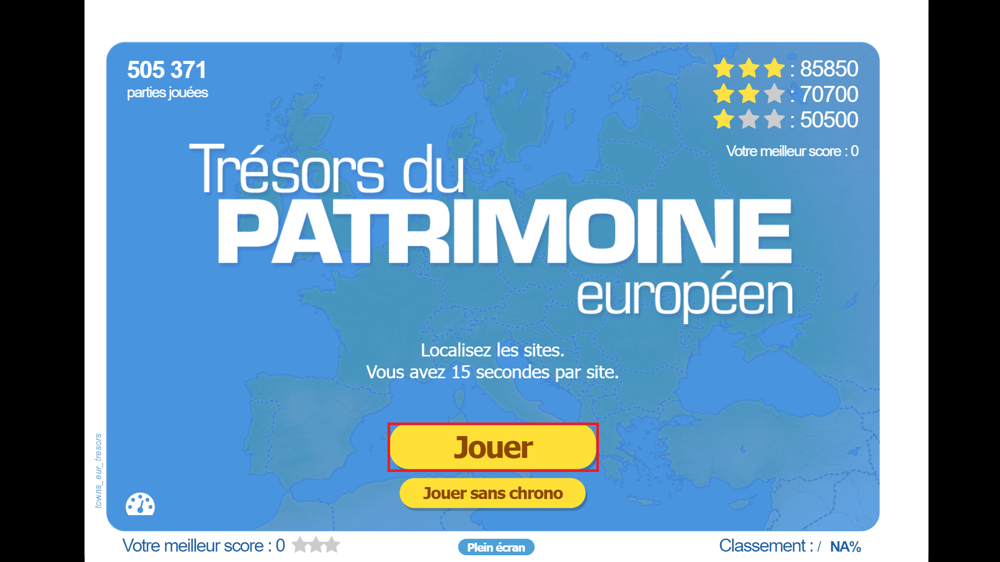
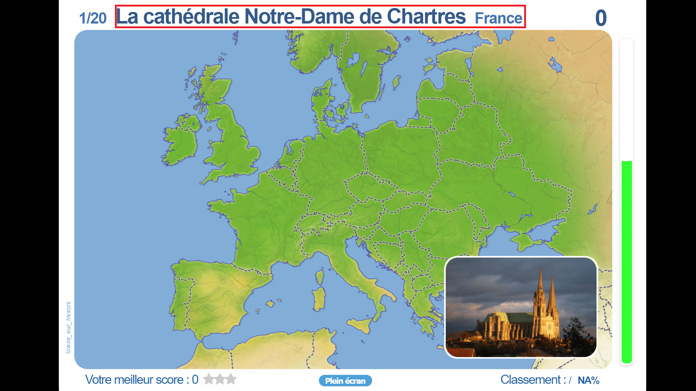
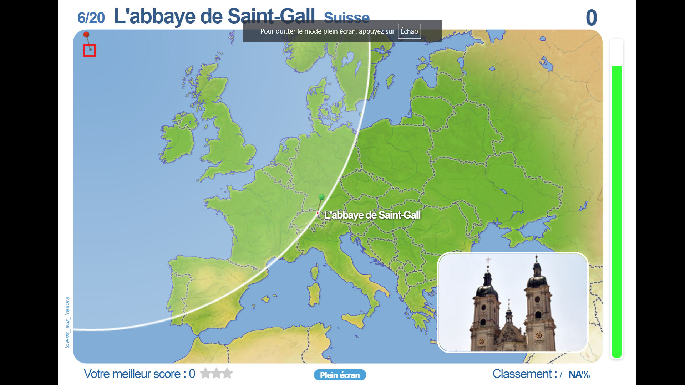
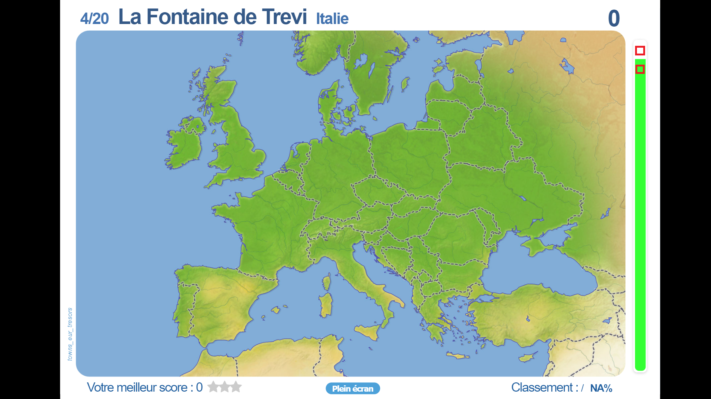
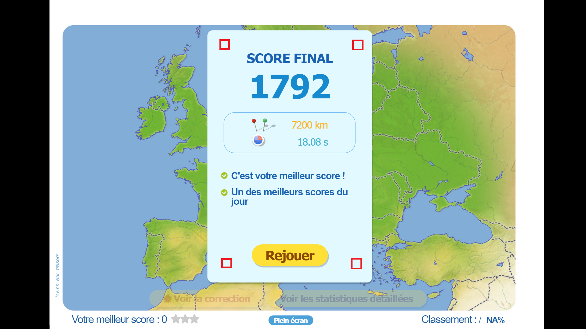

# Bot sur jeux-geographiques

En jouant à un quizz de géographie sur le site https://www.jeux-geographiques.com/ on s'est rendu compte de plusieurs scores particulièrement douteux.
On s'est donc lancé dans la création d'un bot afin de regarder quels scores étaient atteignables.

Langages utilisés: Python
Librairies utilisées: pyautogui, keyboard, easyocr

# Fonctionnement du bot 

Pour lancer l'apprentissage d'un bot sur un quizz en particulier, il faut passer le quizz en plein écran (nécessaire pour calibrer les endroits où cliquer), puis appuyer sur la touche "A" pour lancer l'apprentissage.

Une fois la touche "A" appuyée, le bot va scanner le nom du quizz, et générer un fichier texte (qui servira de base de données) pour ce quizz s'il n'existe pas, ou charger les données s'il existe.

Une fois la base de données créée, le bot appuie sur "Jouer"

## Le quizz commence

On détecte le nom de l'objectif à clicker

# Cas où on n'a pas l'objectif en base

Lorsqu'on n'a pas l'objectif en base, on clicke à un endroit précis (un mauvais endroit), pour faire apparaître la cible (le résultat attendu).

Une fois le résultat affiché, on le détecte, et on stocke ses coordonnées dans la base de données. La prochaine fois où il tombera, le bot clickera sur les coordonnées.

En suite, on attend que la barre de droite commence à nouveau à descendre (ce qui signifie qu'un nouvel essai est en cours)

On détecte un pixel blanc sur la zone du haut, et un pixel vert sur la zone du bas, ce qui permet d'assurer un très bon temps de ping (1.1s en moyenne)

## Le quizz se termine

Pour détecter la fin du quizz, on scanne les quatre pixels indiqués ci-dessous, et s'ils sont tous bleu clair, on lance une série d'input qui relancent le quizz.

La série d'input est la suivante:
- On appuie sur 'f5' pour actualiser la page
- On scrolle vers le haut de la page
- On scrolle jusqu'à trouver le bouton 'plein écran'
- On appuie sur 'plein écran'
- On appuie sur 'start'

Pour terminer le quizz, il faut maintenir la touche 'q'

# Performances et améliorations

Pour l'instant, le bot permet d'atteindre les meilleurs scores du site. Il clique à une précision de 1km en moyenne, en 1.1 seconde.
Pour améliorer ces performances, on pourrait ajouter un système de détection de la distance lors du ping, et de modifier les coordonnées en fonction.

## Pour compliquer l'utilisation du bot, les administrateurs pourraient générer des cibles différentes, compliquant l'agréggation des coordonnées des cibles, ou afficher les noms des cibles à des endroits différentes, ou avec des fonds différents, pour compliquer leur détection.
